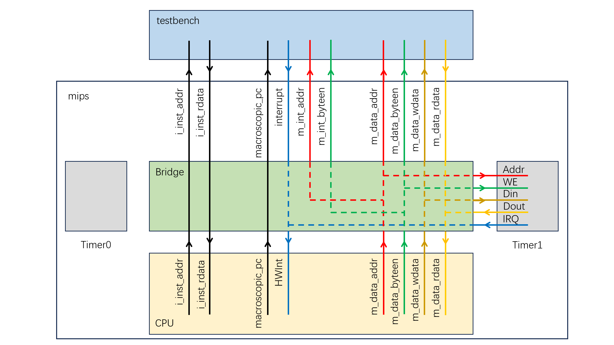
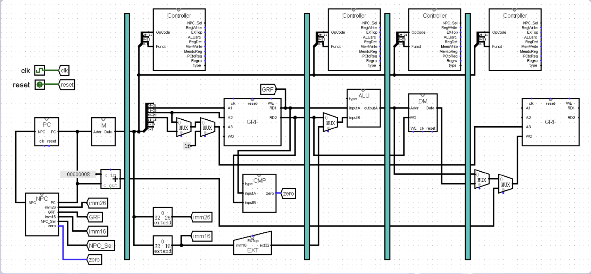
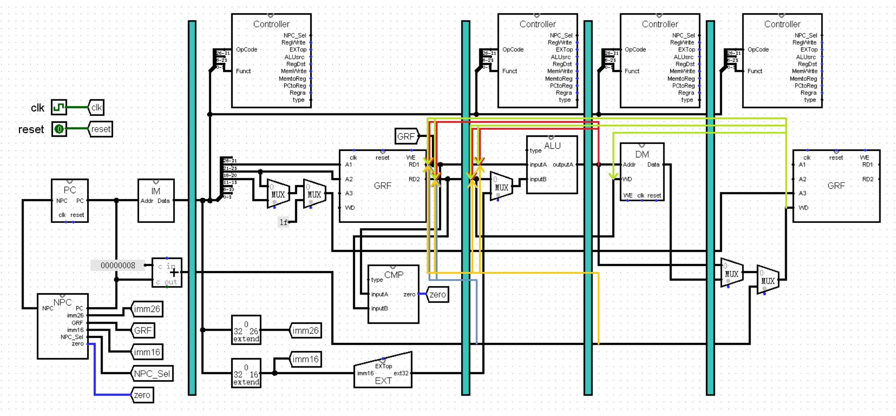
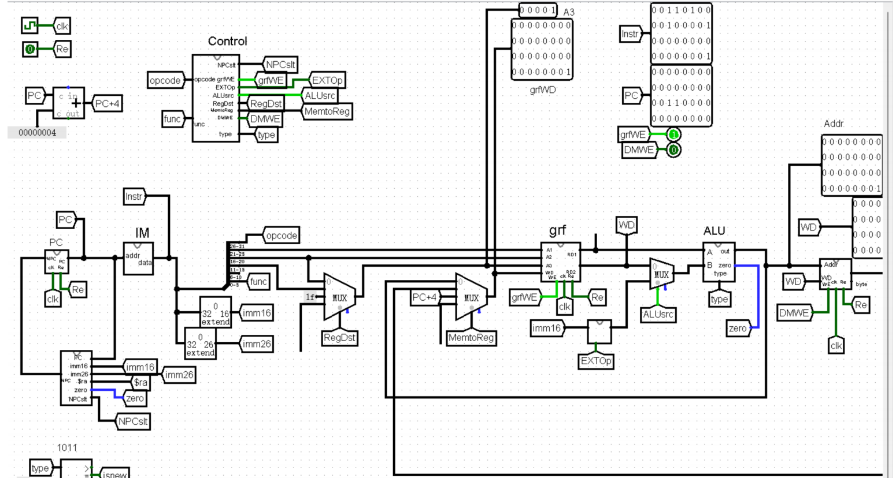
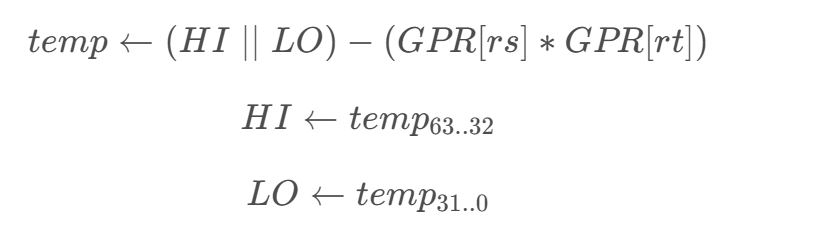
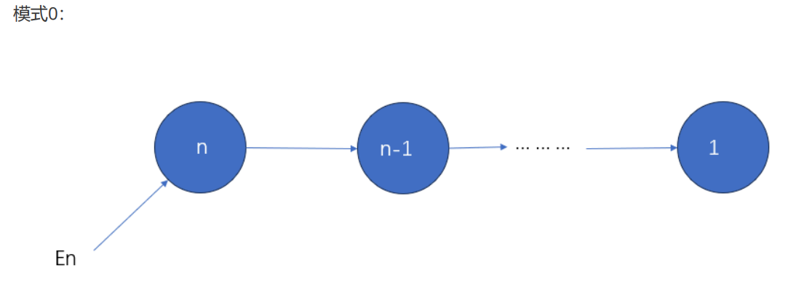
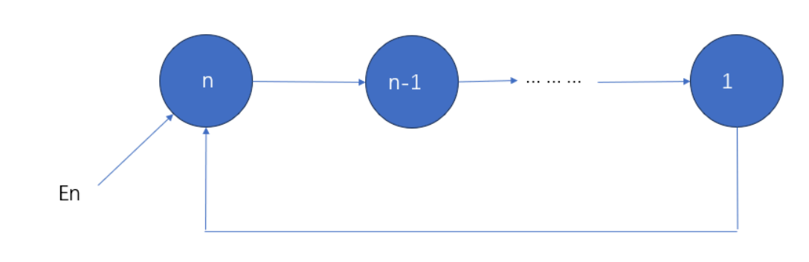

# <center>P7设计文档</center>




> !!!注意IM DM 范围约束的时候必须查PC/DMaddr+3<=xxx


| 异常与中断码 | 助记符与名称            | 指令与指令类型 | 描述                                               |
| ------------ | ----------------------- | -------------- | -------------------------------------------------- |
| 0            | Int<br>（外部中断）     | 所有指令       | 中断请求，来源于计时器与外部中断。                 |
| 4            | AdEL<br>（取指异常）    | 所有指令       | PC地址未字对齐。<br>PC地址超过 0x3000 ~ 0xffffc。  |
| 4            | AdEL<br>（取数异常）    | lw             | 取数地址未与4字节对齐。                            |
| 4            | AdEL<br>（取数异常）    | lh             | 取数地址未与2字节对齐。                            |
| 4            | AdEL<br>（取数异常）    | lh, lb         | 取Timer寄存器的值。                                |
| 4            | AdEL<br>（取数异常）    | load型指令     | 计算地址时加法溢出。                               |
| 4            | AdEL<br>（取数异常）    | load型指令     | 取数地址超出DM、Timer0、Timer1、中断发生器的范围。 |
| 5            | AdES<br>（存数异常）    | sw             | 存数地址未4字对齐。                                |
| 5            | AdES<br>（存数异常）    | sh             | 存数地址未2字对齐。                                |
| 5            | AdES<br>（存数异常）    | sh, sb         | 存Timer寄存器的值。                                |
| 5            | AdES<br>（存数异常）    | store型指令    | 计算地址加法溢出。                                 |
| 5            | AdES<br>（存数异常）    | store型指令    | 向计时器的Count寄存器存值。                        |
| 5            | AdES<br>（存数异常）    | store型指令    | 存数地址超出DM、Timer0、Timer1、中断发生器的范围。 |
| 8            | Syscall<br>（系统调用） | syscall        | 系统调用。                                         |
| 10           | RI<br>（未知指令）      | -              | 未知的指令码。                                     |
| 12           | Ov<br>（溢出异常）      | add, addi, sub | 算术溢出。                                         |


## P7新增模块声明

**CP0**
| 端口      | 方向 | 位数 | 解释             |
| --------- | ---- | ---- | ---------------- |
| clk       | I    | 1    | 时钟信号         |
| reset     | I    | 1    | 复位信号         |
| en        | I    | 1    | 写使能信号       |
| addr      | I    | 5    | 寄存器地址       |
| data      | I    | 32   | CP0 写入数据     |
| CP0out    | O    | 32   | CP0 读出数据     |
| VPC       | I    | 32   | 受害 PC          |
| BDIn      | I    | 1    | 是否是延迟槽指令 |
| ExcCodeIn | I    | 5    | 记录异常类型     |
| HWInt     | I    | 6    | 输入中断信号     |
| EXLCIr    | I    | 1    | 用来复位 EXL     |
| EPCOut    | O    | 32   | EPC 的值         |
| Req       | O    | 1    | 进入处理程序请求 |

### M级
*DE* 针对lw lh lb
| 信号名     | 方向 | 描述                                                                           |
| ---------- | ---- | ------------------------------------------------------------------------------ |
| addr       | I    | 加载操作的地址输入，其最低0 1位用于LB（字节加载）/LH（半字加载）的半字位置定位 |
| data       | I    | 从存储器读取的原始32位数据，作为LB/LH/LW加载操作的数据源                       |
| type       | I    | 加载类型控制信号（LB=5'b01011、LH=5'b01100、LW=5'b01101）                      |
| fixed_data | O    | 经过符号扩展的最终加载数据**符号扩展**为32位                                   |


*BE* 针对sw sh sb
| 信号名     | 方向 | 描述                                                                                                        |
| ---------- | ---- | ----------------------------------------------------------------------------------------------------------- |
| addr       | I    | 存储写操作的地址输入，其最低1位（SH）/最低2位（SB）用于定位半字/字节的存储位置                              |
| data       | I    | 待写入存储器的原始32位数据                                                                                  |
| type       | I    | 存储类型控制信号（SB=5'b01110、SH=5'b01111、SW=5'b10000）                                                   |
| DMWE       | O    | 存储器字节写使能信号（4位，每1位对应1个字节的写使能）                                                       |
| fixed_data | O    | 地址对齐后的待写存储器数据：SW直接输出原始数据；SH/SB根据地址将目标半字/字节放到对应字节位置，其余位**补0** |

### F级
*PC*
| 信号名    | 方向 | 描述             |
| --------- | ---- | ---------------- |
| clk       | I    | 时钟信号         |
| reset     | I    | 异步复位信号     |
| PC_en     | I    | PC使能信号       |
| NPC[31:0] | I    | 下一条指令的地址 |
| PC[31:0]  | O    | 目前的指令地址   |

实现方法：用12位地址、32位数据的ROM作为IM。将PC-0x3000存入储存PC的寄存器中，寄存器中的值可以直接对应ROM要获取指令的地址，从而完成指令输出。

*NPC*
| 信号名      | 方向 | 描述                                                        |
| ----------- | ---- | ----------------------------------------------------------- |
| F_PC[31:0]  | 输入 | 当前取指阶段的PC值（指令地址）                              |
| imm16[15:0] | 输入 | 16位立即数（BEQ指令的地址偏移量，需符号扩展后计算跳转地址） |
| imm26[25:0] | 输入 | 26位立即数（J/JAL指令的跳转地址段，拼接PC高位生成目标地址） |
| GRF[31:0]   | 输入 | 通用寄存器堆读出的地址（JR指令的跳转目标PC值）              |
| NPCslt[1:0] | 输入 | 下一条PC选择控制信号（来自D_Control模块，控制跳转逻辑）     |
| zero        | 输入 | 比较结果标志（来自CMP模块，BEQ指令跳转的判断条件）          |
| NPC[31:0]   | 输出 | 下一条指令的PC地址（生成PC+4、分支跳转、直接跳转）          |

---

### D级
*D_Control*
| 信号名        | 方向 | 描述                                                  |
| ------------- | ---- | ----------------------------------------------------- |
| opcode[5:0]   | 输入 | 指令操作码                                            |
| func[5:0]     | 输入 | 功能码，用于R型指令细分                               |
| type[3:0]     | 输出 | 运算/操作类型选择信号                                 |
| NPCslt[1:0]   | 输出 | 下一条PC选择信号，控制PC的更新方式                    |
| ALUsrc        | 输出 | ALU操作数B的来源选择（寄存器或立即数扩展）            |
| grfWE         | 输出 | 通用寄存器堆写使能信号                                |
| RegDst[1:0]   | 输出 | 通用寄存器堆写地址选择（rd、rt或31号）                |
| EXTOp         | 输出 | 立即数扩展类型选择（符号扩展或零扩展）                |
| MemtoReg[1:0] | 输出 | 寄存器堆写入数据来源选择（ALU结果、内存数据或PC+8等） |
| DMWE          | 输出 | 数据存储器写使能信号                                  |
| t_rs[3:0]     | 输出 | rs寄存器被使用的时间                                  |
| t_rt[3:0]     | 输出 | rt寄存器被使用的时间                                  |
| t[3:0]        | 输出 | 产生新数据的时间                                      |

*CMP*
| 信号名       | 方向 | 描述                                                  |
| ------------ | ---- | ----------------------------------------------------- |
| inputA[31:0] | 输入 | 比较操作数A                                           |
| inputB[31:0] | 输入 | 比较操作数B                                           |
| type[3:0]    | 输入 | 比较类型                                              |
| zero[0]      | 输出 | 比较结果标志：BEQ类型下inputA等于inputB时为1，否则为0 |

*EXT*
| 信号名      | 方向 | 描述                                     |
| ----------- | ---- | ---------------------------------------- |
| imm16[15:0] | 输入 | 16位立即数（待扩展数据）                 |
| EXTOp       | 输入 | 扩展模式选择信号（0=零扩展，1=符号扩展） |
| EXT32[31:0] | 输出 | 扩展后的32位数据                         |

*grf*
| 信号名      | 方向 | 描述                                |
| ----------- | ---- | ----------------------------------- |
| clk         | I    | 时钟信号                            |
| reset       | I    | 异步复位信号                        |
| grfWE       | I    | 写入使能信号                        |
| PC[31:0]    | I    | 当前PC值--W级的PC(W_PC）            |
| A1[4:0]     | I    | 指定一个寄存器并将其中数据读出到RD1 |
| A2[4:0]     | I    | 指定一个寄存器并将其中数据读出到RD2 |
| A3[4:0]     | I    | 指定一个寄存器作为写入数据的目标    |
| grfWD[31:0] | I    | 要写入的数据                        |
| RD1[31:0]   | O    | $rs                                 |
| RD2[31:0]   | O    | $rt                                 |

该模块直接使用P0中搭建的GRF(并新增PC的输入便于输出测试)。

---

### E级
E_Control

*ALU*
| 信号名    | 方向 | 描述             |
| --------- | ---- | ---------------- |
| A[31:0]   | 输入 | 操作数A          |
| B[31:0]   | 输入 | 操作数B          |
| type[3:0] | 输入 | 操作类型选择信号 |
| out[31:0] | 输出 | 运算结果         |

---

p4cpu：




### 思考题
- Q1：请查阅相关资料，说明鼠标和键盘的输入信号是如何被 CPU 知晓的？
- A: 鼠标和键盘等外设并不是直接与CPU相连的，中间需要通过软件来连接，这个软件也就是我们熟知的驱动。驱动和硬件之间通过操作系统进行处理。


- Q2：请思考为什么我们的 CPU 处理中断异常必须是已经指定好的地址？如果你的 CPU 支持用户自定义入口地址，即处理中断异常的程序由用户提供，其还能提供我们所希望的功能吗？如果可以，请说明这样可能会出现什么问题？否则举例说明。（假设用户提供的中断处理程序合法）
- A:我认为依旧可以实现，无非是需要更改一下CPU中当出现异常或中断时要跳转到的异常处理程序地址，之后由用户提供的程序依旧可以对中断和异常进行处理。但入口常常变动会导致该CPU的适用性降低，换个执行指令段执行可能就需要换个入口。
- Q3：为何与外设通信需要 Bridge？
- A:外设实在是太多了，如果每个外设都要针对CPU做单独处理那么时间与经济成本实在是过于昂贵且没必要了，所以采用Bridge方式，通过一个 CPU 视图下的内存地址，读写相应数据即可达到与外设沟通的目的，统一化了外设，DM处理起来十分方便，且扩展性好，新加外设在系统桥进行添加即可，无需单独为其设计一套读写逻辑。
- Q4：请阅读官方提供的定时器源代码，阐述两种中断模式的异同，并分别针对每一种模式绘制状态移图
- A:模式0产生的是定时中断而模式1产生的是周期性脉冲。

- Q5：倘若中断信号流入的时候，在检测宏观 PC 的一级如果是一条空泡（你的 CPU 该级所有信息均为空）指令，此时会发生什么问题？在此例基础上请思考：在 P7 中，清空流水线产生的空泡指令应该保留原指令的哪些信息？
- A:此时EPC可能收录到错误的pc值，从而当eret返回时地址错误。解决办法是保留空泡指令的PC和BD信
息，从而保证返回时指令地址正确。
- Q6：为什么 jalr 指令为什么不能写成 jalr $31, $31 ？
pc既要跳转到31寄存器内的值的位置，又要将pc+4赋值给31号寄存器。这同时给31寄存器存值和取值，
发生了结构冒险，操作的先后顺序无法确定，故不能如此操作。
- [P7 选做] 请详细描述你的测试方案及测试数据构造策略
- A:测试采用 “半随机自动生成 + 手动定向优化” 的混合策略，尽力全面验证处理器指令执行的正确性，采用Python随机生成（详见Student_judge）的方法，覆盖功能型指令的逻辑完整性、跳转指令的控制流稳定性。在基础模板的基础上，通过手动修改指令序列，针对性引入数据冒险与控制冒险场景两类指令在数据冒险、控制冒险场景下的处理能力，既保证测试用例的批量生成效率，又精准覆盖高风险的边缘执行场景。
我的测试代码：
```
# AdEL
	# lw align
	ori $2,$0,2
	lw $5,0($2)
	# lh align
	ori $2,$0,1
	lh $5,0($2)
	# lh,lb to Timer 
	ori $2,$0,0x7F00
	lh $5,0($2)
	lb $5,0($2)
	ori $2,$0,0x7F10
	lh $5,0($2)
	lb $5,0($2)
	# DM_ADDR Overflow
	ori $2,$0,0xffffffff
	ori $3,$0,2
	lw $5,0($2)
	lh $5,0($2)
	lb $5,0($2)
	# Out Of Range
	ori $2,$0,0x7f24
	lw $5,0($2)
	lh $5,0($2)
	lb $5,0($2)
# AdES
	# sw align
	ori $2,$0,2
	sw $5,0($2)
	# sh align
	ori $2,$0,1
	sh $5,0($2)
	# sh,sb to Timer 
	ori $2,$0,0x7F00
	sh $5,0($2)
	sb $5,0($2)
	ori $2,$0,0x7F10
	sh $5,0($2)
	sb $5,0($2)
	# DM_ADDR Overflow
	ori $2,$0,0xffffffff
	ori $3,$0,2
	sw $5,0($2)
	sh $5,0($2)
	sb $5,0($2)
	# Save to count
	ori $2,$0,0x7f08
	sw $5,0($2)
	sh $5,0($2)
	sb $5,0($2)
	ori $2,$0,0x7f18
	sw $5,0($2)
	sh $5,0($2)
	sb $5,0($2)
	# Out Of Range
	ori $2,$0,0x7f25
	sw $5,0($2)
	sh $5,0($2)
	sb $5,0($2)
	
# Syscall
	ori $2,$0,32
	syscall	
# Ov
	ori $2,$0,0x7fffffff
	ori $3,$0,1
	add $5,$2,$3
	addi $5,$2,1
	
	ori $2,$0,0xffffffff
	ori $3,$0,0xffffffff
	sub $5,$2,$3
# RI 
	j next
	nop
	next:
	ori $2,$0,0xffffffff
	
# Special: PC associated
	ori $20,$0,1
	ori $21,$0,0x00002fff
	jal next_1
	nop
	next_1:
	jr $21
	nop
	ori $20,$0,0
	
	ori $20,$0,1
	ori $21,$0,0x00003001
	jal next_2
	nop
	next_2:
	jr $21
	nop
	ori $20,$0,0
	
ori $31,$0,0xffffffff	
end:
beq $0,$0,end
	
.ktext 0x4180
	mfc0 $6,$12
	mfc0 $7,$13
	mfc0 $8,$14
	ori $2,$0,0
	
	mfc0 $k0, $13
    	ori $k1, $0, 0x7c
    	and $k0, $k0, $k1
    	
    	ori $25,$0,0x00000020
    	beq $k0,$25,handle_syscall
    	nop
    	ori $25,$0,0x00000028
    	beq $k0,$25,handle_syscall
    	nop
    	bne $20,$0,handle_pc
    	nop
 
    	return:
    	mfc0 $k0, $14
    	addi $k0, $k0, 4
    	sw $k0,0($0)
    	lw $18,0($0)
    	mtc0 $18, $14
	eret

	handle_syscall:
	mfc0 $k0, $14
    	addi $k0, $k0, 4
    	mtc0 $k0, $14
    	beq $0,$0,return
    	nop
    	
    	handle_pc:
    	add $21,$31,8
    	mtc0 $31,$14
    	beq $0,$0,return
    	nop
ori $gp,$0,0x1800
ori $sp,$0,0x2ffc
lui $9 0x5e57
lui $15 0x22e9
add $15 $9 $15
lui $9 0x7fff
addi $9 $9 32767
addi $9 $9 32767
addi $15 $9 18023
lui $9 0x855f
lui $15 0x781a
sub $15 $9 $15
mult $18 $8
add $21 $19 $17
ori $15 $0 12012
sh $18 -4826($15)
ori $12 $0 26692
lw $10 -14784($12)
mthi $12
lui $18 0xa1da
ori $17 $19 60319
mfhi $11
nop
mflo $12
addi $13 $11 30408
sub $8 $15 $8
addi $17 $10 -15693
sub $18 $19 $19
mflo $17
ori $12 $13 49093
addi $12 $19 13886
multu $14 $9
add $12 $11 $19
nop
ori $19 $0 13568
sh $8 -5054($19)
mult $8 $15
ori $12 $12 1
div $19 $12
mflo $13
and $8 $9 $13
andi $21 $19 43880
ori $11 $0 32631
sb $11 -28330($11)
addi $12 $21 7419
sltu $15 $20 $10
multu $18 $15
nop
lui $9 0x8e4a
ori $16 $0 24906
sb $21 -16085($16)
mfhi $15
ori $18 $18 1
div $8 $18
ori $19 $0 26704
sb $9 -20467($19)
sub $19 $17 $15
ori $14 $0 20717
sw $9 -12981($14)
and $17 $21 $13
andi $15 $14 24921
mtlo $16
sltu $14 $13 $20
sub $10 $20 $13
sub $14 $20 $14
ori $14 $0 22780
lh $21 -16484($14)
mtlo $19
ori $14 $14 1
div $14 $14
add $8 $9 $20
mult $15 $20
mflo $9
and $14 $20 $14
mflo $18
ori $19 $0 4701
lb $21 -377($19)
ori $13 $16 16171
mult $19 $11
mult $19 $14
ori $10 $0 28927
sb $18 -19299($10)
ori $21 $0 17116
sh $21 -12408($21)
mflo $9
addi $9 $9 7992
ori $21 $0 8870
lw $8 -6978($21)
or $15 $19 $10
addi $16 $18 25753
add $10 $8 $17
andi $21 $18 25421
sub $13 $18 $14
nop
lui $18 0x2a9c
addi $17 $21 954
ori $14 $0 32318
sw $20 -26446($14)
mflo $14
add $8 $12 $21
andi $13 $11 49027
mult $12 $12
and $17 $20 $12
or $10 $11 $9
lui $10 0xcadb
andi $14 $10 18629
ori $20 $16 16708
multu $11 $17
ori $11 $11 1
div $9 $11
mtlo $14
ori $8 $0 22788
lb $14 -16501($8)
mult $19 $14
mtlo $20
lui $13 0x18ab
lui $17 0x6889
andi $18 $11 55783
mflo $16
mfhi $10
mflo $10
sltu $15 $16 $15
multu $19 $14
ori $16 $0 25756
sh $16 -23434($16)
and $18 $10 $9
add $18 $20 $21
ori $8 $0 26685
sw $9 -22673($8)
ori $17 $17 1
divu $19 $17
slt $8 $20 $10
ori $16 $0 8797
lb $20 -1944($16)
lui $21 0x246c
lui $21 0x7974
add $21 $21 $21
lui $21 0x7fff
addi $21 $21 32767
addi $21 $21 32767
addi $21 $21 123
lui $21 0x8a26
lui $21 0x7d06
sub $21 $21 $21
ori $14 $0 16596
lh $21 -6892($14)
ori $18 $0 20357
lb $11 -12744($18)
ori $8 $8 1
div $15 $8
slt $21 $18 $15
ori $13 $13 1
divu $12 $13
andi $11 $17 5498
slt $8 $19 $20
ori $11 $11 1
divu $21 $11
sltu $15 $14 $14
ori $12 $0 22037
lb $17 -20342($12)
ori $16 $16 40659
mflo $15
mfhi $19
lui $14 0xe222
or $18 $19 $18
and $21 $12 $11
ori $11 $11 1
div $16 $11
ori $9 $0 30216
lh $19 -18724($9)
or $10 $18 $20
and $20 $21 $19
mfhi $8
andi $12 $13 56803
ori $14 $14 1
div $21 $14
ori $17 $0 14254
lh $8 -4400($17)
and $15 $16 $8
mflo $21
sub $13 $8 $11
mflo $18
mtlo $13
ori $9 $9 1
divu $21 $9
ori $10 $10 1
div $18 $10
mthi $9
mult $14 $17
addi $11 $15 -28029
ori $21 $0 29037
sw $19 -24709($21)
mthi $21
slt $13 $20 $14
multu $13 $16
mult $21 $13
ori $11 $0 7653
lw $19 3647($11)
ori $20 $0 11952
sw $21 -10508($20)
and $21 $10 $16
slt $21 $14 $16
ori $8 $0 30446
lh $14 -22598($8)
andi $21 $19 20029
sltu $9 $10 $13
ori $20 $20 1
divu $9 $20
mtlo $11
addi $14 $10 10383
lui $8 0xb390
mult $17 $14
ori $16 $0 19
lw $10 2113($16)
slt $19 $16 $10
ori $8 $14 10669
ori $20 $0 313
lh $10 4387($20)
andi $11 $19 12673
addi $21 $19 20859
multu $14 $20
ori $16 $0 1564
lb $17 4770($16)
ori $18 $0 32322
sb $21 -29447($18)
or $9 $19 $13
sltu $12 $14 $10
sltu $13 $15 $20
nop
addi $10 $14 30636
ori $15 $0 32392
sb $13 -21420($15)
ori $20 $0 31090
lb $18 -22689($20)
or $17 $13 $16
ori $16 $0 10885
sw $15 -7429($16)
ori $11 $10 9095
ori $15 $0 19565
sb $13 -10317($15)
ori $12 $0 27446
lw $8 -19198($12)
slt $8 $10 $13
ori $8 $0 32119
lh $20 -21337($8)
addi $17 $17 14315
ori $21 $0 29236
lb $19 -22231($21)
ori $21 $0 29027
sh $21 -26427($21)
or $21 $17 $11
ori $18 $16 52960
addi $11 $11 8125
lui $16 0xf3e8
or $8 $19 $13
add $16 $9 $15
mflo $12
sub $19 $15 $17
slt $10 $10 $15
ori $18 $0 8341
lh $10 1285($18)
nop
multu $8 $8
ori $16 $0 10168
lh $9 -1914($16)
ori $11 $0 31478
lh $17 -30538($11)
ori $9 $0 19409
sb $21 -10642($9)
add $13 $13 $17
ori $17 $0 32748
sh $13 -29604($17)
nop
lui $12 0x2fe0
sltu $17 $13 $17
ori $20 $0 4882
sw $20 6630($20)
ori $20 $19 42587
slt $14 $15 $12
ori $2 $0 60898
add $18 $2 $0
lw $9 0($18)
sw $9 0($18)
ori $2 $0 967
add $18 $2 $0
lh $13 0($18)
sh $13 0($18)
ori $2 $0 32541
lh $18 0($18)
sh $20 0($18)
lw $12 0($18)
sw $15 0($18)
ori $2 $0 32522
lh $12 0($18)
sh $13 0($18)
lw $12 0($18)
sw $15 0($18)
add $1 $0 $18
ori $18 $0 32523
sw $18 0($1)
lw $3 0($18)
lw $21 0($3)
lui $18 0x0
lw $16 32523($18)
ori $18 $0 31136
sw $18 0($1)
lw $3 0($18)
sw $18 0($3)
ori $8 $8 1
div $14 $8
ori $12 $12 1
div $18 $12
ori $15 $15 1
divu $9 $15
and $11 $17 $17
mfhi $15
nop
sub $12 $13 $8
ori $13 $0 15464
lh $19 -8714($13)
ori $16 $0 13059
sb $21 -12342($16)
ori $14 $14 1
divu $11 $14
mult $8 $18
lui $13 0xffe6
mfhi $11
sltu $10 $14 $19
sub $12 $15 $13
ori $20 $20 1
divu $21 $20
ori $11 $0 7000
lw $11 4896($11)
ori $17 $17 1
divu $16 $17
ori $12 $0 23658
lb $11 -14345($12)
sltu $16 $18 $18
ori $9 $0 14126
lb $17 -8850($9)
mflo $11
andi $16 $14 32172
slt $13 $9 $20
ori $14 $10 19826
and $19 $10 $11
mtlo $19
or $18 $14 $9
or $8 $20 $16
sltu $13 $17 $9
mtlo $19
mfhi $21
mthi $14
ori $12 $12 1
divu $9 $12
mflo $13
multu $9 $16
slt $14 $10 $12
ori $11 $11 1
div $14 $11
ori $11 $0 9048
sb $21 -4736($11)
ori $17 $17 1
divu $8 $17
mult $10 $19
ori $20 $0 1068
sb $9 7045($20)
ori $16 $14 64608
mthi $20
sltu $10 $11 $17
multu $11 $18
ori $11 $0 17301
sh $20 -17035($11)
ori $12 $0 20328
lw $10 -10064($12)
slt $18 $19 $18
mfhi $11
ori $9 $9 1
divu $15 $9
ori $13 $0 13457
sw $17 -5561($13)
ori $11 $11 1
div $12 $11
ori $9 $9 1
divu $17 $9
ori $10 $10 1
divu $9 $10
mthi $11
lui $11 0xe206
sltu $14 $17 $9
sltu $11 $15 $11
ori $19 $0 22077
sb $18 -10875($19)
lui $21 0xa35
ori $18 $0 24124
lw $20 -19360($18)
slt $10 $17 $11
ori $15 $15 1
div $16 $15
sub $13 $15 $17
ori $11 $0 2660
lh $9 -786($11)
mtlo $10
multu $14 $9
ori $21 $0 14183
lh $17 -13473($21)
lui $12 0x61d2
ori $21 $0 19645
sw $18 -13785($21)
and $15 $21 $9
ori $20 $20 1
div $11 $20
multu $19 $18
sub $20 $18 $21
mult $14 $9
addi $8 $11 9996
ori $19 $0 5526
sh $15 2252($19)
multu $16 $12
multu $17 $18
ori $11 $0 981
sb $21 8191($11)
ori $15 $0 5158
sw $21 5450($15)
ori $13 $8 33031
ori $8 $0 4862
lw $14 5274($8)
nop
ori $15 $0 29947
sw $19 -28263($15)
mtlo $11
sub $10 $19 $10
mfhi $15
ori $19 $0 27187
lh $18 -23755($19)
ori $13 $0 31279
sh $10 -19261($13)
lui $14 0x3088
mflo $10
lui $8 0x6f39
nop
mflo $8
ori $16 $0 430
sb $21 859($16)
sltu $21 $11 $8
mthi $15
ori $12 $0 18543
lh $17 -10187($12)
ori $2 $0 845
add $19 $2 $0
lw $19 0($19)
sw $15 0($19)
ori $2 $0 15533
add $19 $2 $0
lh $9 0($19)
sh $14 0($19)
ori $2 $0 32541
lh $18 0($19)
sh $8 0($19)
lw $10 0($19)
sw $14 0($19)
ori $2 $0 287
lh $19 0($19)
sh $10 0($19)
lw $14 0($19)
sw $11 0($19)
add $1 $0 $19
ori $19 $0 39970
sw $19 0($1)
lw $3 0($19)
lw $12 0($3)
lui $19 0x0
lw $9 21579($19)
ori $19 $0 32521
sw $19 0($1)
lw $3 0($19)
sw $19 0($3)
ori $13 $13 1
div $12 $13
andi $21 $18 15505
sltu $17 $9 $12
ori $20 $0 2718
sw $19 6158($20)
ori $19 $20 49698
slt $12 $18 $14
andi $16 $12 40539
ori $11 $0 24635
lw $10 -16263($11)
ori $11 $0 15064
sb $21 -8676($11)
mthi $9
ori $8 $0 20347
sw $17 -13935($8)
slt $18 $15 $14
ori $15 $0 31926
sh $16 -31766($15)
ori $10 $11 55341
ori $13 $13 1
divu $8 $13
mult $21 $16
mult $14 $10
lui $19 0x2651
lui $13 0x61a1
mflo $13
mthi $8
mtlo $8
ori $19 $0 29499
sw $8 -26295($19)
mult $9 $8
ori $10 $0 1488
lw $15 9256($10)
lui $18 0x1d14
ori $16 $9 6046
lui $15 0xc4a1
ori $15 $0 3523
sh $12 4841($15)
multu $10 $12
multu $18 $16
ori $19 $0 29604
lb $19 -24357($19)
slt $8 $21 $18
mthi $9
mfhi $18
ori $19 $0 91
lh $21 6263($19)
lui $21 0xd743
multu $16 $8
sltu $20 $20 $21
ori $20 $0 21016
sb $15 -16932($20)
ori $8 $21 43521
mfhi $10
sub $18 $10 $16
ori $11 $0 17943
lh $17 -11507($11)
and $10 $12 $10
mfhi $19
sub $19 $14 $21
mflo $19
mfhi $15
ori $15 $0 15789
sb $8 -12563($15)
ori $21 $9 27420
mflo $13
ori $18 $0 8141
lh $12 -5181($18)
ori $9 $14 10485
ori $19 $0 17548
lb $14 -7122($19)
ori $20 $0 5931
sw $9 3021($20)
and $18 $19 $10
mfhi $9
ori $21 $21 1
divu $16 $21
multu $21 $21
multu $14 $20
ori $13 $0 23026
lb $10 -21541($13)
addi $10 $18 8069
ori $13 $0 10802
sb $17 -7780($13)
mtlo $20
lui $19 0x422d
mtlo $9
ori $8 $0 7553
lb $15 -2137($8)
ori $15 $0 4178
sh $21 3696($15)
ori $20 $0 8796
lw $15 -6748($20)
ori $9 $0 527
sw $13 281($9)
andi $19 $9 39505
slt $17 $13 $8
ori $17 $17 1
divu $8 $17
slt $8 $8 $8
mtlo $12
mfhi $21
sub $9 $11 $10
mflo $9
ori $10 $0 26116
lh $20 -19416($10)
ori $17 $17 1
divu $8 $17
nop
mfhi $20
nop
slt $21 $9 $8
multu $8 $12
mflo $11
or $15 $12 $18
ori $11 $0 8109
sw $12 3363($11)
lui $12 0x33c3
ori $21 $0 13635
sw $8 -3663($21)
mfhi $14
and $15 $20 $19
addi $19 $20 26986
ori $19 $0 11185
lb $8 -143($19)
ori $21 $0 22091
sw $10 -14535($21)
ori $20 $0 25626
lw $15 -24738($20)
lui $13 0x7481
sub $8 $9 $20
ori $15 $0 16556
sh $11 -15430($15)
ori $24 $0 2448
sw $24 0($0)
lw $24 0($0)
jr $24
nop
ori $24 $0 35223
jr $24
nop
ori $24 $0 2478
add $3 $24 $0
jr $3
nop
ori $24 $0 2495
sub $24 $24 $0
jr $24
nop
ori $24 $0 2514
add $3 $24 $0
sub $2 $3 $0
jr $3
nop
jal PCException1_start
nop
jal PCException1_end
ori $31 $0 18919
PCException1_start:      jr $31
PCException1_end:       nop
ori $24 $0 18944
sw $24 0($0)
lw $2 0($0)
sub $10 $21 $15
add $12 $10 $19
jr $2
nop
sltu $18 $10 $8
and $21 $13 $10
ori $15 $0 31239
lb $10 -20037($15)
ori $17 $0 14468
lb $18 -6818($17)
ori $18 $20 51013
sub $14 $8 $8
mfhi $17
or $20 $20 $13
mflo $17
add $16 $20 $21
ori $10 $0 15131
lb $11 -4186($10)
ori $20 $0 24758
lb $9 -24133($20)
ori $9 $0 25632
lb $20 -14874($9)
ori $21 $0 24999
lh $15 -19597($21)
ori $21 $0 18972
lh $14 -9544($21)
ori $21 $0 7327
sh $17 -2331($21)
or $15 $14 $13
ori $8 $0 15495
lb $13 -6375($8)
lui $20 0xaa3f
ori $10 $10 1
divu $14 $10
ori $11 $11 1
div $8 $11
ori $17 $0 2561
sh $9 2947($17)
ori $11 $0 24379
sb $16 -19232($11)
ori $13 $0 28796
lw $19 -27464($13)
nop
ori $13 $13 1
divu $13 $13
mthi $19
ori $14 $0 3589
sh $21 -1389($14)
ori $11 $0 31573
lw $19 -19877($11)
mfhi $19
and $12 $11 $8
ori $21 $0 32322
sh $8 -31152($21)
ori $19 $0 9187
sw $10 -4991($19)
mult $19 $8
mflo $11
ori $20 $0 13559
sb $12 -2905($20)
andi $13 $17 62218
or $20 $12 $14
ori $8 $0 19307
sh $8 -15887($8)
lui $16 0x520e
mthi $18
add $18 $8 $16
ori $9 $0 6394
sb $9 -5531($9)
multu $13 $16
mthi $11
andi $19 $8 29919
sub $9 $10 $12
addi $18 $13 11343
slt $18 $11 $10
mfhi $12
add $12 $8 $17
ori $13 $13 1
divu $19 $13
multu $19 $20
andi $13 $17 37625
ori $21 $0 9741
lh $13 -7779($21)
addi $16 $17 -28602
mult $11 $17
nop
mthi $18
addi $9 $14 30661
ori $13 $0 30618
sh $20 -20526($13)
mflo $12
sltu $11 $10 $12
andi $13 $17 45431
mthi $10
ori $20 $20 1
divu $16 $20
nop
or $18 $21 $12
sub $11 $20 $15
sub $19 $15 $14
addi $10 $14 30272
mflo $16
ori $20 $0 27591
lb $10 -27522($20)
sltu $11 $16 $18
ori $19 $0 18944
lb $19 -9624($19)
ori $15 $0 13326
lh $21 -1322($15)
sltu $19 $16 $18
lui $8 0x9006
ori $10 $0 10664
lh $18 642($10)
mult $9 $14
mthi $21
multu $20 $17
andi $10 $20 2680
lui $9 0x70f0
add $9 $11 $18
sub $18 $20 $11
multu $10 $18
slt $16 $12 $8
ori $18 $18 1
divu $14 $18
ori $15 $15 1
divu $14 $15
ori $8 $8 1
div $20 $8
mfhi $11
ori $11 $0 5448
sh $16 430($11)
mtlo $21
sltu $8 $9 $12
ori $9 $9 1
divu $8 $9
ori $16 $0 9655
lh $14 -1209($16)
ori $17 $0 29522
sb $19 -21130($17)
mthi $14
ori $16 $0 14604
lw $19 -6168($16)
ori $10 $0 3137
sw $10 0($0)
lw $10 0($0)
jr $10
nop
ori $10 $0 3148
jr $10
nop
ori $10 $0 35925
add $3 $10 $0
jr $3
nop
ori $10 $0 19561
sub $10 $10 $0
jr $10
nop
ori $10 $0 35961
add $3 $10 $0
sub $2 $3 $0
jr $3
nop
jal PCException2_start
nop
jal PCException2_end
ori $31 $0 35987
PCException2_start:      jr $31
PCException2_end:       nop
ori $10 $0 36012
sw $10 0($0)
lw $2 0($0)
sub $9 $16 $13
add $16 $21 $20
jr $2
nop
add $17 $8 $20
mfhi $9
ori $20 $0 21620
lw $21 -15324($20)
ori $19 $0 9760
sh $9 898($19)
ori $14 $14 1
div $12 $14
mthi $12
addi $15 $12 28501
slt $18 $13 $14
sltu $18 $13 $14
mtlo $10
sub $10 $8 $17
slt $11 $21 $20
ori $20 $0 7638
lh $16 -4830($20)
ori $20 $0 25509
sb $19 -24849($20)
ori $20 $20 1
div $9 $20
ori $17 $0 26858
lh $19 -15618($17)
ori $17 $0 9967
lw $11 -8555($17)
mflo $14
ori $12 $0 20194
sw $11 -17070($12)
mfhi $18
ori $8 $0 17372
sb $17 -6395($8)
ori $14 $0 10065
lw $13 -9245($14)
mult $10 $14
mflo $15
mthi $14
ori $17 $18 48092
andi $12 $21 36876
ori $12 $0 18994
lh $14 -13762($12)
sub $16 $11 $15
ori $17 $17 1
div $13 $17
ori $19 $0 3024
lw $17 -188($19)
ori $13 $13 1
div $10 $13
and $8 $21 $20
ori $11 $11 1
div $21 $11
addi $11 $15 18696
multu $9 $16
ori $11 $0 28912
sh $15 -24478($11)
ori $17 $0 29620
sw $13 -19084($17)
ori $19 $0 2135
lw $11 -331($19)
nop
lui $18 0x232b
ori $15 $15 1
divu $15 $15
lui $17 0xcc53
sub $14 $13 $10
mtlo $11
ori $15 $0 29425
lw $8 -22397($15)
slt $14 $16 $19
ori $16 $0 1927
lh $17 213($16)
ori $8 $12 25191
slt $19 $16 $17
lui $8 0x7545
ori $14 $14 1
div $21 $14
sub $12 $15 $20
sub $15 $18 $10
or $13 $18 $18
mthi $20
ori $13 $0 20862
lb $8 -10295($13)
mthi $19
ori $16 $0 27215
lw $16 -23067($16)
ori $14 $0 1798
lw $17 8906($14)
ori $8 $8 1
divu $13 $8
ori $20 $0 7565
lb $16 -655($20)
addi $9 $12 26508
ori $11 $0 10978
lb $18 -1942($11)
mtlo $21
ori $17 $0 19939
lw $15 -15123($17)
add $9 $14 $18
ori $13 $0 8843
lw $14 -7123($13)
mfhi $11
ori $12 $12 1
div $10 $12
sltu $12 $16 $13
sltu $20 $18 $12
sltu $18 $14 $10
ori $8 $0 25824
sb $15 -21325($8)
ori $20 $20 1
divu $20 $20
mtlo $16
ori $11 $0 20915
sw $20 -10839($11)
or $19 $11 $13
add $9 $20 $20
or $19 $15 $18
mtlo $14
ori $17 $17 1
divu $17 $17
andi $10 $18 56542
ori $20 $20 1
divu $14 $20
and $19 $12 $15
slt $18 $13 $14
slt $14 $12 $19
ori $8 $8 1
div $14 $8
nop
ori $14 $0 7033
sw $13 -1837($14)
mflo $17
ori $20 $12 56869
ori $16 $16 1
divu $20 $16
mflo $14
mtlo $11
mthi $14
nop
multu $19 $14
mflo $21
mult $14 $19
nop
nop
nop
nop
nop
nop
nop
nop
nop
nop
nop
nop
nop
nop
nop
nop
nop
nop
nop
nop
nop
nop
nop
nop
nop
nop
nop
nop
nop
nop
nop
nop
nop
nop
nop
nop
nop
nop
nop
nop
nop
nop
nop
nop
nop
nop
nop
nop
nop
nop
nop
nop
nop
nop
nop
nop
nop
nop
nop
nop
nop
nop
nop
nop
nop
nop
nop
nop
nop
nop
nop
nop
nop
nop
nop
nop
nop
nop
nop
nop
nop
nop
nop
nop
nop
nop
nop
nop
nop
nop
nop
nop
nop
hello:     ori $24 $0 36037
md:    lw $2 0($0)
nop
nop
nop
nop
nop
nop
nop
nop
nop
nop
nop
nop
nop
nop
nop
nop
nop
nop
nop
nop
nop
nop
nop
nop
nop
nop
nop
nop
nop
nop
nop
nop
nop
nop
nop
nop
nop
nop
nop
nop
nop
nop
nop
nop
nop
nop
nop
nop
nop
nop
nop
nop
nop
nop
nop
nop
nop
nop
nop
nop
nop
nop
nop
nop
nop
nop
nop
nop
nop

        _entry:
            mfc0    $k0, $12
            andi    $k0, $k0, 0x0002
            beq     $k0, $0,  exit
            nop
           _save_context:
            ori     $k0,    $0, 0x1000     # 淇濆瓨涓婁笅鏂?
                addi    $k0,    $k0, -256
                sw  $sp,    116($k0)        # 淇濆瓨鏍堟寚閽?
                add     $sp,    $k0, $0
                sw      $8, 32($sp)
                sw      $9, 36($sp)
                sw      $31, 124($sp)
            mfhi    $k0
                mflo    $k1
                sw $k0, 128($sp)
                sw $k1, 132($sp)
            jal _main_handler
            nop
    
           _main_handler:
            mfc0    $k0, $13
            lui     $k1, 0x8000
            and     $t0, $k0, $k1
            bne     $t0, $0, BD
            nop
            jal     BD_end
            BD:
            mfc0    $k1, $14
            addi    $k1, $k1, 4
            mtc0    $k1, $14
            BD_end:
            ori     $k1, $0, 0x007c
            and     $k0, $k1, $k0
            beq     $0, $k0, interrupt
            nop
            ori     $k1, $0, 16
            beq     $k1, $k0, Adel
            nop
            jal     Adel_end
            nop
            Adel:
                mfc0    $k1,    $14
                ori     $t0,    $0, 0x3000
                ori     $t1,    $0, 1
                slt     $t0,    $k1, $t0
                beq     $t0,    $t1, hand
                nop
                ori     $t0,    $0, 0x6ffc
                slt     $t0,    $t0, $k1
                beq     $t0,    $t1, hand
                nop
                andi    $k1,    $k1, 0xfffc
                mtc0    $k1,    $14
                jal     Adel_end
                nop
            hand:
                ori     $t0,    $0, 0x3ffc
                divu    $k1,    $t0
                mfhi    $k1
                andi    $k1,    $k1, 0xfffc
                addi    $k1,    $k1, 0x3000
                mtc0    $k1,    $14
            Adel_end:
                mfc0    $k0, $14
                add     $k0, $k0, 4
                mtc0    $k0, $14
                jal     _restore_context
                nop
    
           interrupt:
            mfc0    $k0, $13
            andi    $k0, $k0, 0x1000
            beq     $k0, $0, interrupt1
            nop
            sb      $0, 0x7f20($0)
            jal     interrupt_end
            nop
            interrupt1:
            andi    $k0, $k0, 0x0800
            beq     $k0, $0, interrupt2
            nop
            sw      $0, 0x7f10($0)
            jal     interrupt_end
            nop
            interrupt2:
            andi    $k0, $k0, 0x0400
            beq     $k0, $0, interrupt_end
            nop
            sw      $0, 0x7f00($0)
            jal     interrupt_end
            nop
            interrupt_end:
            jal     _restore_context
            nop
    
           _restore_context:
                lw      $8, 32($sp)
                lw      $9, 36($sp)
            lw      $k0, 128($sp)
            lw      $k1, 132($sp)
            lw      $31, 124($sp)
            mthi    $k0
            mtlo    $k1
            lw      $sp, 116($sp)
            beq     $0, $0, _restore
            nop
           _restore:
            eret
           exit:
        back_beq_end_text: beq $0, $0, back_beq_end_text
        nop
        
```
